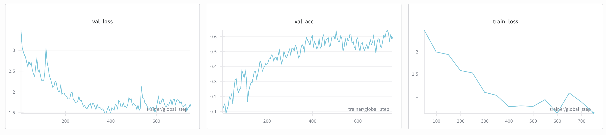

## Third attempt: Using timeseries representations
Still in progress, and will update as I go on.

You can view the scripts related to this attempt at `src.ml.architectures.lstm`,
`src.ml.pretrain`.

Currently, LSTM pretraining on my own ~970 mouse samples does not exceed a test
accuracy of 0.16. I suspect there's some bug.

-- 

Fixes implemented:
- Up epochs from 25 to 50 to 150
    - Accuracy continues to climb (and will continue to climb);
      now at 40% test acc (from 16%)
- Include as many trials as possible, and use class weights
    - Previously (can still see this in `src.ml.finetune`) I would discard
      trials from classes with more trials than the min class. This was a very
      destructive way to balance my dataset.
    - Went from 970 to 1100 trials on 1/20/26 when I made this change
    - Didn't actually improve performance markedly on a 50 epoch, 256 batch size
      run (40% -> 39%)
- Up the LR
    - We were climbing steadily at 150 epochs, just very slowly. I increased it by an OOM from
      `1e-3` to `1e-2`
    - This carried our val acc higher (around `62%`), but test acc didn't
      improve as much (`40%` to `48%`)

With these changes, we're still capping out around `48%` test accuracy, with
very noisy training.

More fixes:
*all run with batch_size 256, lr 1e-2*
- Increase model capacity
    - `hidden_size` from `64` to `128`
        - 52k -> 200k params: max test acc: 69.5% (8m runtime)
    [ ] `num_layers` from `2` to `4`
        - 52k -> 120k params: max test acc: 55.5% (15m runtime!)

- Lowering LR to 1e-3 does NOT improve performance (61.2% accuracy on 128 hidden size)
- Upping batch size only speeds things up. 256 = 60% usage; 512 = 70% usage
- Adding dropout of 0.1 doesn't improve accuracy (62% test)

-- 
01.31.26
Have increased accuracy to a maximum of `69%`, achieved over 100 epochs on a
`471K` param LSTM (4 layers, 128 hidden) and `1216` train samples (added digits,
which inflated sample count over 63 classes). 

Given that this is 10 more classes than previously tested on, I can attribute
the increase in accuracy to the greater model capacity (`471K` is the largest
LSTM trained yet). It's still NOT good, but only `~12%` off from the current
63-class CNN (which, although having a pretraining phase, is still much faster
to train).
